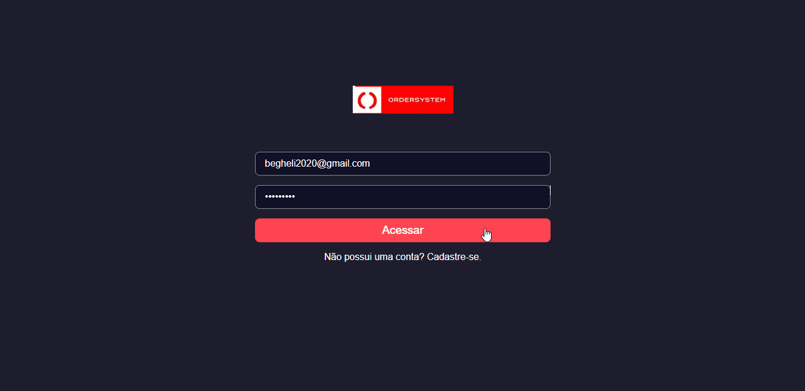

<h1>Sistema para restaurantes</h1>

>Projeto sistema para restaurantes e/ou pizzaria.  
>Tecnologias usadas: Next.js, React.js, Typescript, Node.js, Sass
>Banco de dados: postgresql

Nesse sistema auxiliamos estabelecimentos de comida fazendo com que eles controlem e acompanhem os pedidos que são feitos. O garçom chega com o <a href="https://github.com/marcusvinicius0/restaurants-system-mobile" target="_blank">aplicativo</a> nos clientes e abre uma mesa, salvando os pedidos feitos e logo em seguida finalizando a mesa. Na aplicação web pode-se adicionar categorias e produtos para essas categorias, além de acompanhar os pedidos feitos pelo app.
